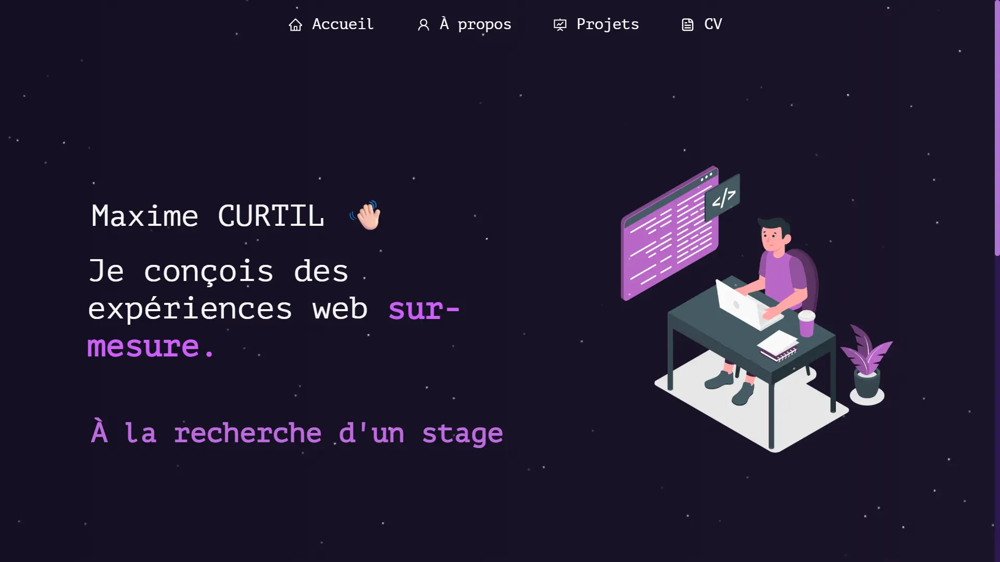

# Portfolio Personnel - Maxime CURTIL

  

Bienvenue sur le dépôt de mon portfolio. Cet espace me permet de présenter mes projets, mon parcours ainsi que mes compétences techniques de manière interactive.

🚀 **Démo en ligne : [akefis.github.io/Portfolio](https://akefis.github.io/Portfolio)**

## 🛠️ Stack Technique

Ce projet a été construit avec les technologies suivantes :

- **Frontend :** React.js, React-Bootstrap
- **Styling :** CSS
- **Outils :** Node.js, Git

## Fonctionnalités

**📖 Multi-Page Layout**

**🎨 Stylisé avec React-Bootstrap et CSS**

**📱 100% responsive**

## Pour commencer

Clonez ce dépôt. Vous aurez besoin de `node.js` et de `git` installés globalement sur votre machine.

## 🛠️ Instructions d'installation et de configuration

1.  Installation : `npm install`
2.  Dans le répertoire du projet, vous pouvez exécuter : `npm start`

Exécute l'application en mode développement.
Ouvrez [http://localhost:3000](http://localhost:3000) pour la voir dans le navigateur.
La page se rechargera si vous faites des modifications.

## Instructions d'utilisation

Ouvrez le dossier du projet et naviguez vers `/src/components/`.
Vous y trouverez tous les composants utilisés et pourrez modifier vos informations en conséquence.
